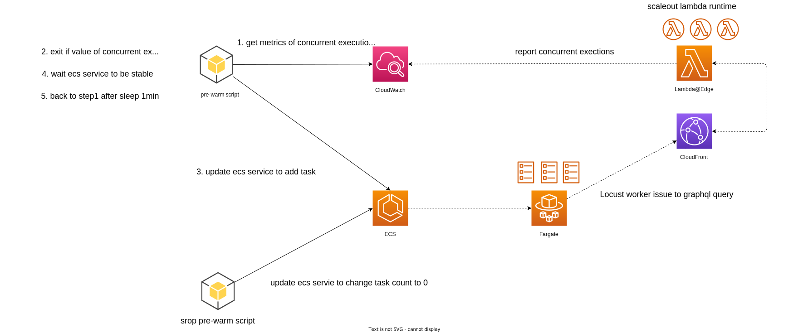

## pre-warm lambda edge function for amazon-cloudfront-cache-graphql



## example
```shell
$ python3 prewarm_lambda_edge.py \
--ecs_cluster locust-load-test \
--ecs_service locust-graphql \
--target_number 150 \
--function_name us-east-1.${function_name} \
--profile ${profile}
```

```shell
$ python3 stop_prewarm.py \
--ecs_cluster locust-load-test \
--ecs_service locust-graphql \
--profile ${profile}
```
## required aws resources
- VPC
- IGW
- PublicSubnet
- RouteTabale
- ECS Cluster
- ECS Service
- ECS TaskDefinition
- ECR Repository

## develop script
```shell
$ python3 -m venv .venv
$ . .venv/bin/activate
$ python3 -m pip install -r requirements.txt
```

## buid container image
### run on local
```shell
$ cd locust/local
$ docker buildx build -t tag_name .
$ docker run \
--env TARGET_HOST=host_name \
--env USERS=number_of_users \
--env SPAWN_RATE=spawn_rate \
--env RUN_TIME=run_time \
-t \
--name container_name \
tag_name
```

```shell
# example
$ docker run \
--env TARGET_HOST=${hostnmae} \
--env USERS=10 \
--env SPAWN_RATE=1 \
--env RUN_TIME=60s \
-t \
--name my-custom-locustv0.1 \
my-custom-locust-image:v0.1
```
### run on ecs/fargate
1. login ECR
2. build container image
```shell
$ docker buildx build --platform=linux/amd64 -t locust-load-test:v0.1 .
```
3. add tag
4. push ECR
5. update ecs task definition
